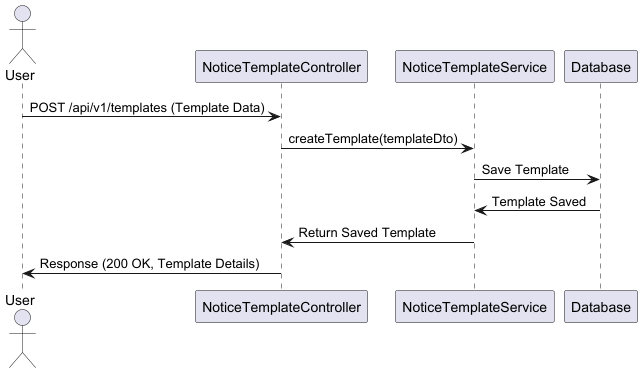

# Design Documentation - Notice PDF Generation System

## Overview
The **Notice PDF Generation System** is designed to create notices and generate PDFs from pre-defined templates. The system follows a **microservices** approach and uses **Spring Boot** for efficient processing.

---

## Architecture Overview
### **System Components**
| Component | Description |
|-----------|-------------|
| **Notice Service** | Manages notices (CRUD operations) |
| **Template Service** | Stores and retrieves notice templates |
| **PDF Service** | Converts notices into PDFs asynchronously |
| **Database** | Stores notices and templates (MySQL) |

---

## Sequence Diagram
### **Notice Template API**
This API saves an HTML-based notice template in database that will be used for PDF generation.

### **Notice API**
This API creates a new notice with recipient details and associates it with a template.

### **PDF Generation API**
This API retrieves a notice, processes its template, and generates a PDF.

---

